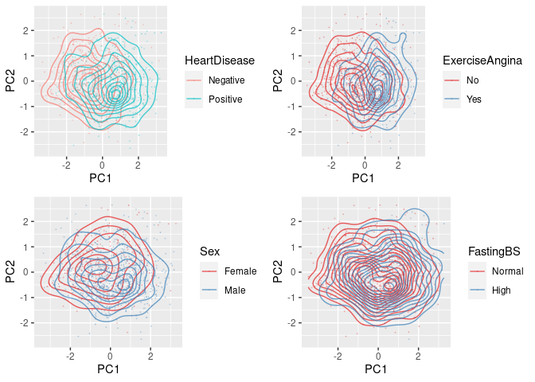
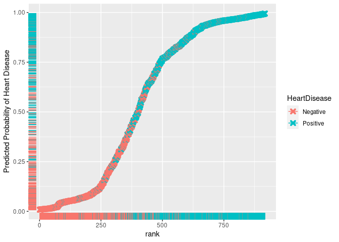

Heart Failure Prediction
================
Alex Hetherington
05/11/2021

# 1 Load in Dataset

This dataset contains 12 columns, with the last column being the
predictive column - whether or not the patient has heart disease.

-   Age: age of the patient \[years\]
-   Sex: sex of the patient \[M: Male, F: Female\]
-   ChestPainType: chest pain type \[TA: Typical Angina, ATA: Atypical
    Angina, NAP: Non-Anginal Pain, ASY: Asymptomatic\]
-   RestingBP: resting blood pressure \[mm Hg\]
-   Cholesterol: serum cholesterol \[mm/dl\]
-   FastingBS: fasting blood sugar \[1: if FastingBS > 120 mg/dl, 0:
    otherwise\]
-   RestingECG: resting electrocardiogram results \[Normal: Normal, ST:
    having ST-T wave abnormality (T wave inversions and/or ST elevation
    or depression of > 0.05 mV),LVH: showing probable or definite left
    ventricular hypertrophy by Estes’ criteria\]
-   MaxHR: maximum heart rate achieved \[Numeric value between 60 and
    202\]
-   ExerciseAngina: exercise-induced angina \[Y: Yes, N: No\]
-   Oldpeak: oldpeak = ST \[Numeric value measured in depression\]
-   ST_Slope: the slope of the peak exercise ST segment \[Up: upsloping,
    Flat: flat, Down: downsloping\]
-   HeartDisease: output class \[1: heart disease, 0: Normal\]

``` r
# Loading in data, recoding factor levels and assigning correct column data types.

setwd("~/Documents/Heart Failure Prediction")
data <- as_tibble(data.frame(read.csv('heart.csv')))
data$HeartDisease <- recode(as.factor(data$HeartDisease),'0' = 'Negative','1' = 'Positive')
data$FastingBS <- recode(as.factor(data$FastingBS),'0' = 'Normal','1' = 'High')
data$Sex <- recode(as.factor(data$Sex),"M" = "Male","F" = "Female")
data$ChestPainType <- as.factor(data$ChestPainType)
data$RestingECG <- relevel(as.factor(data$RestingECG),2)
data$ExerciseAngina <- recode(as.factor(data$ExerciseAngina),"N" = "No","Y" = "Yes")
data$ST_Slope <- as.factor(data$ST_Slope)


numeric_data = select_if(data,is.numeric)
print(paste("# Missing Values :" , sum(is.na(data))))
```

    ## [1] "# Missing Values : 0"

# 2 EDA (Exploratory Data Analysis)

``` r
## Initial demographic plots of gender and age.
p1 <- ggplot(data = data,aes(x = Sex)) + geom_bar(aes(fill = HeartDisease))
p2 <- ggplot(data = data,aes(x = Age,y = Sex)) + geom_jitter(aes(color = HeartDisease),height = 0.2,alpha = 0.2) + geom_boxplot(alpha = 0.2)
p_grid <- plot_grid(p1 + theme(legend.position = "none"),
                    p2 + theme(legend.position = "none"),
                    ncol = 1)
legend_obj <- get_legend(p1)
plot_grid(p_grid,legend_obj,rel_widths = c(1.5,.5))
```

<!-- -->

The dataset is heavily weighted to men, with 79.5% of the data
comprising male subjects. Looking at a frequency table between gender
and Heart Disease, it is immediately apparent that Men have a much
higher rate of heart disease than women. Most of the people in this
dataset are relatively old, with a median age for each gender in the low
50’s. There is no skew in age between gender for these data. Whilst
factors affecting Heart Disease can be evaluated with this data, this is
notably not indicative of the general population and so conclusions
shouldn’t be drawn about the overall **prevalence** of Heart Disease /
any contributing factors in general.

Without accurate knowledge of the general population and the prevalence
of independent variables the nomenclature/practice of odds and odds
ratios should be used rather than risk and risk ratios.

``` r
## Chi Squared test of independence
gend_tab <- table(data$Sex,data$HeartDisease)
chisq.test(gend_tab,correct = FALSE)
```

    ## 
    ##  Pearson's Chi-squared test
    ## 
    ## data:  gend_tab
    ## X-squared = 85.646, df = 1, p-value < 2.2e-16

``` r
oddsratio(gend_tab,method = "wald")$measure
```

    ##         odds ratio with 95% C.I.
    ##          estimate    lower    upper
    ##   Female 1.000000       NA       NA
    ##   Male   4.905918 3.437758 7.001083

With a very small p-value in the Chi-squared test, we crudely conclude
that there is a significant correlation between gender and heart
disease. Also we derive a crude estimate with 95% confidence that your
odds of heart disease are increase by 391% for men compared to women.

## 2.1 Continuous Variables

Taking just the numeric data, a matrix of scatter plots and correlations
is drawn.

``` r
temp = numeric_data
temp$HeartDisease = data$HeartDisease
ggpairs(temp,columns = 1:5,ggplot2::aes(colour = HeartDisease,alpha = 0.3,shape = '.'),upper = NULL)
```

<!-- -->

Not much can be clearly seen from this; much of the data is clustered
together and hard to see correlations. The diagonal plots the
distribution of each factor coloured by heart disease. From this we see
that those who have heart disease are generally older and have a lower
maximum heart rate.

Of particular note is a noticeable density of near 0 cholesterol levels.
There is also a single observation of a 0 RestingBP, and so this datum
is removed.

``` r
## Remove "RestingBP = 0" datum
data <- data[data$RestingBP != 0,]
temp <- numeric_data <- select_if(data,is.numeric)

## Plot histogram for cholesterol
ggplot(data = data,aes(x = Cholesterol,fill = HeartDisease)) + geom_histogram(bins = 40)
```

<!-- -->

These observations could be reasonably omitted and removed from the
data, however instead they will be itself the subject of prediction for
precursive model that can interpolate more appropriate cholesterol
values.

``` r
temp$HeartDisease = as.numeric(data$HeartDisease)
ggcorr(temp,method = "pairwise",label = TRUE,label_round = 3,low = "Purple",mid = "White",high = "Green",name = "Correlation")
```

<!-- -->

The largest magnitude correlation (among independent variables) is
between Age and MaxHR, with a slight negative correlation (-0.382).
Resting blood pressure appears not to correlate strongly with any other
continuous variable nor heart disease.

``` r
ggplot(data = data,aes(x = Age,y = MaxHR,colour = HeartDisease)) + geom_point(alpha = 0.1) + geom_smooth(aes(fill = HeartDisease),alpha = 0.2)
```

    ## `geom_smooth()` using method = 'loess' and formula 'y ~ x'

<!-- -->

``` r
faraway::vif(numeric_data)
```

    ##         Age   RestingBP Cholesterol       MaxHR     Oldpeak 
    ##    1.290633    1.103014    1.084216    1.241029    1.098714

Plotting Age against MaxHR we see the trend is seen clearly. The older
you are, the lower your maximum heart rate, which is as expected with a
large decrease in the amount of exercise older people tend to do. Across
all ages, a lower maximum heart rate is associated with an increased
rate of Heart Disease. With a quick look at the variance inflation
factor we see no immediate cause for concern over collinearity between
continuous variables.

## 2.2 Categorical Variables

``` r
## Create Each plot in turn
p1 <- ggplot(data = data,aes(x = Sex)) + geom_bar(aes(fill = HeartDisease),stat = "count",position = "dodge")
p2 <- ggplot(data = data,aes(x = ChestPainType)) + geom_bar(aes(fill = HeartDisease),stat = "count",position = "dodge")
p3 <- ggplot(data = data,aes(x = FastingBS)) + geom_bar(aes(fill = HeartDisease),stat = "count",position = "dodge")
p4 <- ggplot(data = data,aes(x = RestingECG)) + geom_bar(aes(fill = HeartDisease),stat = "count",position = "dodge")
p5 <- ggplot(data = data,aes(x = ExerciseAngina)) + geom_bar(aes(fill = HeartDisease),stat = "count",position = "dodge")
p6 <- ggplot(data = data,aes(x = ST_Slope)) + geom_bar(aes(fill = HeartDisease),stat = "count",position = "dodge")

## Align into a grid, remove individual legends
p_grid <- plot_grid(p1 + theme(legend.position = "none"),
          p2 + theme(legend.position = "none"),
          p3 + theme(legend.position = "none"),
          p4 + theme(legend.position = "none"),
          p5 + theme(legend.position = "none"),
          p6 + theme(legend.position = "none"),
          ncol = 2)
legend_obj <- get_legend(p1)
## Display
plot_grid(p_grid,legend_obj,rel_widths = c(3,.6))
```

<!-- -->

``` r
## ~ Exercise Angina OR
temp <- table(data$ExerciseAngina,data$HeartDisease)
print('Exercise Angina')
```

    ## [1] "Exercise Angina"

``` r
oddsratio(temp)$measure[-1,]
```

    ##  estimate     lower     upper 
    ## 10.627077  7.644486 14.995695

``` r
## ~ ST_Slope OR
##Combine Down and Flat into one level to compare with Up
temp_ST_Slope <- data$ST_Slope
levels(temp_ST_Slope) <- c('Down/Flat','Down/Flat','Up')
temp <- table(temp_ST_Slope,data$HeartDisease)
print('ST Slope')
```

    ## [1] "ST Slope"

``` r
oddsratio(temp,rev = 'rows')$measure[-1,]
```

    ## estimate    lower    upper 
    ## 18.63525 13.41392 26.18785

A FastingBS(Fasting blood sugar) level of under 100 mg/dL is considered
normal, and over 126 consistently is grounds to diagnose diabetes. It
therefore makes sense that having a high FastingBS level can indicate
heart problems, however the converse is not necessarily true; the counts
for normal FastingBS don’t indicate heart disease well. Exercise Angina
shows a good correlation with HeartDisease, with most with
ExerciseAngina having heart disease and most without not having heart
disease. The odds of heart disease for exercise-induced angina are
approximately 10 times that of those without (CI : (7.61,14.92)).
ST_Slope also seems a very important indicator of heart disease, with
Down and Flat slopes associated more with heart disease, and an Up slope
correlating with no heart disease; combining the Down and Flat slopes
into a single level, we get that the odds of heart disease for Down/Flat
slopes are 18.67 (CI : (13.45,26.25)) times the odds for Up slopes.

RestingECG has no clear trend difference between the levels, whilst
ChestPainType does have good variation between levels however curiously
has the asymptomatic group having the highest correlation with heart
disease. In other words, for this data you are more likely to have heart
disease if you don’t have chest pain, and having chest pain may indicate
that you don’t have heart disease! This is most likely as a result of
the bias introduced from the procurement of the dataset; most of the
data is made up of positive cases of heart disease and those with high
risk factors and possible indicators, one such being chest pain.

**The presence of ChestPainType in a real-world model would knowingly
directly cause incorrect prediction behavior for those outside of this
biased sample, and therefore should be reasonably omitted from
prediction.** Although don’t do so in this work as it isn’t meant for
the real world.

## 2.3 Cholesterol Prediction

``` r
## Separate data and remove HeartDisease
x_pred = data[data$Cholesterol == 0,-12]
x_train = data[data$Cholesterol != 0,-12]

## Implementing backwards stepwise regression
lmod = lm(Cholesterol ~ .,data = x_train)
lmod = step(lmod,direction = 'backward',trace = 0)
summary(lmod)
```

    ## 
    ## Call:
    ## lm(formula = Cholesterol ~ Sex + ChestPainType + RestingBP + 
    ##     RestingECG + ST_Slope, data = x_train)
    ## 
    ## Residuals:
    ##     Min      1Q  Median      3Q     Max 
    ## -148.86  -37.60   -4.98   31.09  354.84 
    ## 
    ## Coefficients:
    ##                  Estimate Std. Error t value Pr(>|t|)    
    ## (Intercept)      214.4424    20.2252  10.603  < 2e-16 ***
    ## SexMale          -17.3276     5.0626  -3.423 0.000654 ***
    ## ChestPainTypeATA  -3.1790     6.0940  -0.522 0.602064    
    ## ChestPainTypeNAP -11.8412     5.6353  -2.101 0.035956 *  
    ## ChestPainTypeTA  -18.3740     9.6315  -1.908 0.056820 .  
    ## RestingBP          0.3126     0.1252   2.497 0.012750 *  
    ## RestingECGLVH      9.4948     5.2473   1.809 0.070786 .  
    ## RestingECGST      -4.2380     5.9378  -0.714 0.475625    
    ## ST_SlopeFlat      10.4018     9.4394   1.102 0.270841    
    ## ST_SlopeUp        -0.7738     9.7771  -0.079 0.936943    
    ## ---
    ## Signif. codes:  0 '***' 0.001 '**' 0.01 '*' 0.05 '.' 0.1 ' ' 1
    ## 
    ## Residual standard error: 58.07 on 736 degrees of freedom
    ## Multiple R-squared:  0.04788,    Adjusted R-squared:  0.03624 
    ## F-statistic: 4.112 on 9 and 736 DF,  p-value: 3.535e-05

``` r
print(paste("Datum 150 :: Predicted",predict(lmod,x_train[150,])," - True",x_train$Cholesterol[150]))
```

    ## [1] "Datum 150 :: Predicted 248.160584224351  - True 603"

``` r
par(mfrow = c(2,2))
plot(lmod,cex = 0.5,pch = 19,id.n = 2)
```

<!-- -->

The residuals are evenly distributed around across the fitted values,
which indicates a desired linear relationship. The Q-Q plot shows that
the residuals of the errors are reasonably normal around most of the
data, however is higher for those with extremely high cholesterol.
Looking at individual number 150, their real cholesterol level is 603
\[mm/dl\], which is drastically larger than the predicted 248.2
\[mm/dl\]. The scale-location validates the homoscedasticity assumption
(the variance of the residuals is even across fitted values). No points
in particular have very large leverage and error, with no points
residing outside of cook’s distance.

With a very small R-Squared, and high residual standard error we see
that the data is still spread very wide around the fitted model.
Predictions are likely to be off, even though we don’t know the true
values anyway, as values in the real world are much more varied. As a
result of predicting these values for cholesterol, the data will be more
normalized to the generic cholesterol distribution.

``` r
## Using for predictions
data$Cholesterol[data$Cholesterol == 0] <- predict(lmod,x_pred)
numeric_data = select_if(data,is.numeric)
ggplot(data = data,aes(x = Cholesterol,fill = HeartDisease)) + geom_histogram(bins = 40)
```

<!-- -->
## PCA

``` r
pr <-as.data.frame(prcomp(numeric_data,scale = TRUE)$x)
pr$HeartDisease <- data$HeartDisease
pr$ExerciseAngina <- data$ExerciseAngina
pr$Sex <- data$Sex
pr$FastingBS <- data$FastingBS
pr$FastingBS <- data$FastingBS
p1 <- ggplot(pr,aes(x = PC1,PC2)) + geom_density_2d(alpha = 0.7) + geom_point(alpha = 0.2,size = 0.1) + ylim(-2.7,2.7) + scale_color_distiller(palette="Set1")
p2<- ggplot(pr,aes(x = PC1,PC2,colour = HeartDisease)) + geom_density_2d(alpha = 0.7) + geom_point(alpha = 0.2,size = 0.1) + ylim(-2.7,2.7)
p3 <- ggplot(pr,aes(x = PC1,PC2,colour = ExerciseAngina)) + geom_density_2d(alpha = 0.7) + geom_point(alpha = 0.2,size = 0.1) + ylim(-2.7,2.7) + scale_color_brewer(palette="Set1")
p4 <- ggplot(pr,aes(x = PC1,PC2,colour = Sex)) + geom_density_2d(alpha = 0.7) + geom_point(alpha = 0.2,size = 0.1) + ylim(-2.7,2.7) + scale_color_brewer(palette="Set1")
p5 <- ggplot(pr,aes(x = PC1,PC2,colour = FastingBS)) + geom_density_2d(alpha = 0.7) + geom_point(alpha = 0.2,size = 0.1) + ylim(-2.7,2.7) + scale_color_brewer(palette="Set1")
p1
```

<!-- -->

``` r
plot_grid(p2,p3,p4,p5)
```

<!-- -->

The Overall PCA plot shows two epicenters of the data, roughly separated
across the first principal component axis. Coding contours by some
categorical variables we see that there is some separation in epicenters
of each binary level however there is much overlap. Overall, the clear
separation of negative and positive contours in the HeartDisease plot
show some ability to predict positive and negative cases with only 2
numeric variables, and adding even more explanatory variables will only
improve predictions.

# 3 Logistic model

With a binary response variable, this data can be fitted using a
generalized linear model, using the binomial distribution as the
distribution of the errors and the logit (log-odds) link function. This
means that the coefficients in the model are the increase in the log of
the odds of heart disease resulting from a 1-unit increase in that
factor.

Initially, all factors are considered when predicting heart disease. The
intercept corresponds to an individual who is/has:

-   21, Female, No chest pain, RestingBP of 80 \[mm Hg\], Cholesterol of
    100 \[mm/dl\], Low FastingBS, normal RestingECG, MaxHR of 50bpm, No
    ExeciseAngina, Oldpeak of 0 and Down ST_Slope.

## 3.1 Full Model

``` r
## With binomial response, tecnhically the correct family would be the bernoulli family with the logit link function, 
## However the binomial is used as bernoulli is not in base R, and is the same for this data as bernoulli.
lmod_full =  glm(formula = HeartDisease ~ I(Age-21) + Sex + ChestPainType + I(RestingBP-80) + I(Cholesterol - 100) + FastingBS + RestingECG + I((MaxHR - 50)/50) + ExerciseAngina + Oldpeak + ST_Slope,data = data,family = binomial(link = "logit"))
summary(lmod_full)
```

    ## 
    ## Call:
    ## glm(formula = HeartDisease ~ I(Age - 21) + Sex + ChestPainType + 
    ##     I(RestingBP - 80) + I(Cholesterol - 100) + FastingBS + RestingECG + 
    ##     I((MaxHR - 50)/50) + ExerciseAngina + Oldpeak + ST_Slope, 
    ##     family = binomial(link = "logit"), data = data)
    ## 
    ## Deviance Residuals: 
    ##     Min       1Q   Median       3Q      Max  
    ## -2.8589  -0.3873   0.1865   0.4792   2.6389  
    ## 
    ## Coefficients:
    ##                       Estimate Std. Error z value Pr(>|z|)    
    ## (Intercept)          -1.619897   0.905087  -1.790 0.073491 .  
    ## I(Age - 21)           0.018754   0.013116   1.430 0.152760    
    ## SexMale               1.624431   0.278827   5.826 5.68e-09 ***
    ## ChestPainTypeATA     -1.899651   0.323701  -5.869 4.40e-09 ***
    ## ChestPainTypeNAP     -1.619562   0.259585  -6.239 4.40e-10 ***
    ## ChestPainTypeTA      -1.445163   0.429265  -3.367 0.000761 ***
    ## I(RestingBP - 80)     0.001810   0.006182   0.293 0.769643    
    ## I(Cholesterol - 100)  0.002252   0.002024   1.113 0.265795    
    ## FastingBSHigh         1.340371   0.266749   5.025 5.04e-07 ***
    ## RestingECGLVH        -0.006404   0.267470  -0.024 0.980899    
    ## RestingECGST         -0.006779   0.290590  -0.023 0.981389    
    ## I((MaxHR - 50)/50)   -0.389568   0.244716  -1.592 0.111403    
    ## ExerciseAnginaYes     0.857228   0.240654   3.562 0.000368 ***
    ## Oldpeak               0.360109   0.115583   3.116 0.001836 ** 
    ## ST_SlopeFlat          1.225280   0.426681   2.872 0.004083 ** 
    ## ST_SlopeUp           -1.103790   0.445024  -2.480 0.013127 *  
    ## ---
    ## Signif. codes:  0 '***' 0.001 '**' 0.01 '*' 0.05 '.' 0.1 ' ' 1
    ## 
    ## (Dispersion parameter for binomial family taken to be 1)
    ## 
    ##     Null deviance: 1260.95  on 916  degrees of freedom
    ## Residual deviance:  606.68  on 901  degrees of freedom
    ## AIC: 638.68
    ## 
    ## Number of Fisher Scoring iterations: 5

From the summary output, we see that ResitingBP has a very high p-value,
as does RestingECG. RestingBP and RestingECG were both singled out
earlier as not correlating well with heart disease, and so are removed
first from the model.

### 3.1.1 Step 1

``` r
lmod1 = glm(formula = HeartDisease ~ I(Age-21) + Sex + ChestPainType + I(Cholesterol - 100) + FastingBS + I((MaxHR - 50)/50) + ExerciseAngina + Oldpeak + ST_Slope,data = data,family = binomial(link = "logit"))
summary(lmod1)
```

    ## 
    ## Call:
    ## glm(formula = HeartDisease ~ I(Age - 21) + Sex + ChestPainType + 
    ##     I(Cholesterol - 100) + FastingBS + I((MaxHR - 50)/50) + ExerciseAngina + 
    ##     Oldpeak + ST_Slope, family = binomial(link = "logit"), data = data)
    ## 
    ## Deviance Residuals: 
    ##     Min       1Q   Median       3Q      Max  
    ## -2.8446  -0.3846   0.1843   0.4740   2.6516  
    ## 
    ## Coefficients:
    ##                       Estimate Std. Error z value Pr(>|z|)    
    ## (Intercept)          -1.578587   0.885041  -1.784 0.074484 .  
    ## I(Age - 21)           0.019470   0.012422   1.567 0.117023    
    ## SexMale               1.622152   0.277436   5.847 5.01e-09 ***
    ## ChestPainTypeATA     -1.892969   0.322338  -5.873 4.29e-09 ***
    ## ChestPainTypeNAP     -1.617051   0.259402  -6.234 4.55e-10 ***
    ## ChestPainTypeTA      -1.433659   0.426644  -3.360 0.000779 ***
    ## I(Cholesterol - 100)  0.002314   0.002001   1.156 0.247590    
    ## FastingBSHigh         1.339510   0.265244   5.050 4.42e-07 ***
    ## I((MaxHR - 50)/50)   -0.389595   0.238168  -1.636 0.101882    
    ## ExerciseAnginaYes     0.865154   0.238498   3.628 0.000286 ***
    ## Oldpeak               0.362921   0.114913   3.158 0.001587 ** 
    ## ST_SlopeFlat          1.236685   0.425051   2.909 0.003620 ** 
    ## ST_SlopeUp           -1.090539   0.442983  -2.462 0.013824 *  
    ## ---
    ## Signif. codes:  0 '***' 0.001 '**' 0.01 '*' 0.05 '.' 0.1 ' ' 1
    ## 
    ## (Dispersion parameter for binomial family taken to be 1)
    ## 
    ##     Null deviance: 1260.95  on 916  degrees of freedom
    ## Residual deviance:  606.77  on 904  degrees of freedom
    ## AIC: 632.77
    ## 
    ## Number of Fisher Scoring iterations: 5

``` r
drop1(lmod1)
```

    ## Single term deletions
    ## 
    ## Model:
    ## HeartDisease ~ I(Age - 21) + Sex + ChestPainType + I(Cholesterol - 
    ##     100) + FastingBS + I((MaxHR - 50)/50) + ExerciseAngina + 
    ##     Oldpeak + ST_Slope
    ##                      Df Deviance    AIC
    ## <none>                    606.77 632.77
    ## I(Age - 21)           1   609.23 633.23
    ## Sex                   1   643.84 667.84
    ## ChestPainType         3   669.43 689.43
    ## I(Cholesterol - 100)  1   608.12 632.12
    ## FastingBS             1   634.55 658.55
    ## I((MaxHR - 50)/50)    1   609.45 633.45
    ## ExerciseAngina        1   619.87 643.87
    ## Oldpeak               1   617.03 641.03
    ## ST_Slope              2   714.07 736.07

With a reduction in the AIC, this new model fits the data slightly
better, however looking at the ANOVA table shows a p-value of 0.993 for
the difference between the fit of these two models, and so the two
models are not statistically significantly different. Cholesterol has a
very high p-value, and looking at the drop1 output shows that the next
best variable to drop is Cholesterol (albeit, with a negligibly small
drop in AIC).

### 3.1.2 Step 2

``` r
lmod2 = glm(formula = HeartDisease ~ I(Age-21) + Sex + ChestPainType + FastingBS + I((MaxHR - 50)/50) + ExerciseAngina + Oldpeak + ST_Slope,data = data,family = binomial(link = "logit"))
summary(lmod2)
```

    ## 
    ## Call:
    ## glm(formula = HeartDisease ~ I(Age - 21) + Sex + ChestPainType + 
    ##     FastingBS + I((MaxHR - 50)/50) + ExerciseAngina + Oldpeak + 
    ##     ST_Slope, family = binomial(link = "logit"), data = data)
    ## 
    ## Deviance Residuals: 
    ##     Min       1Q   Median       3Q      Max  
    ## -2.7830  -0.3852   0.1867   0.4788   2.6541  
    ## 
    ## Coefficients:
    ##                    Estimate Std. Error z value Pr(>|z|)    
    ## (Intercept)        -1.25291    0.83663  -1.498 0.134243    
    ## I(Age - 21)         0.01955    0.01242   1.575 0.115280    
    ## SexMale             1.57299    0.27334   5.755 8.67e-09 ***
    ## ChestPainTypeATA   -1.90191    0.32198  -5.907 3.49e-09 ***
    ## ChestPainTypeNAP   -1.64234    0.25835  -6.357 2.06e-10 ***
    ## ChestPainTypeTA    -1.45648    0.42440  -3.432 0.000599 ***
    ## FastingBSHigh       1.34377    0.26450   5.080 3.77e-07 ***
    ## I((MaxHR - 50)/50) -0.37492    0.23709  -1.581 0.113807    
    ## ExerciseAnginaYes   0.87579    0.23820   3.677 0.000236 ***
    ## Oldpeak             0.36040    0.11498   3.135 0.001721 ** 
    ## ST_SlopeFlat        1.27609    0.42334   3.014 0.002576 ** 
    ## ST_SlopeUp         -1.08122    0.44230  -2.445 0.014503 *  
    ## ---
    ## Signif. codes:  0 '***' 0.001 '**' 0.01 '*' 0.05 '.' 0.1 ' ' 1
    ## 
    ## (Dispersion parameter for binomial family taken to be 1)
    ## 
    ##     Null deviance: 1260.95  on 916  degrees of freedom
    ## Residual deviance:  608.12  on 905  degrees of freedom
    ## AIC: 632.12
    ## 
    ## Number of Fisher Scoring iterations: 5

``` r
#drop1(lmod2)
```

The difference between these two models is again very small, however we
can still remove redundant variables for model simplicity at the expense
of a slight increase in AIC. As it happens, this model is the same one
reached when undergoing backwards stepwise regression. Age is now the
next highest p-value, although is very close to MaxHR. As previously
noted, these two variables correlate well with each other, and so the
removal of one may increase the significance of the other.

### 3.1.3 Step 3

``` r
lmod3 = glm(formula = HeartDisease ~ Sex + ChestPainType + FastingBS + I((MaxHR - 50)/50) + ExerciseAngina + Oldpeak + ST_Slope,data = data,family = binomial(link = "logit"))
summary(lmod3)
```

    ## 
    ## Call:
    ## glm(formula = HeartDisease ~ Sex + ChestPainType + FastingBS + 
    ##     I((MaxHR - 50)/50) + ExerciseAngina + Oldpeak + ST_Slope, 
    ##     family = binomial(link = "logit"), data = data)
    ## 
    ## Deviance Residuals: 
    ##     Min       1Q   Median       3Q      Max  
    ## -2.7812  -0.3923   0.1847   0.4750   2.7736  
    ## 
    ## Coefficients:
    ##                    Estimate Std. Error z value Pr(>|z|)    
    ## (Intercept)         -0.4138     0.6429  -0.644 0.519759    
    ## SexMale              1.5477     0.2726   5.677 1.37e-08 ***
    ## ChestPainTypeATA    -1.9104     0.3214  -5.945 2.77e-09 ***
    ## ChestPainTypeNAP    -1.6168     0.2565  -6.304 2.90e-10 ***
    ## ChestPainTypeTA     -1.4029     0.4193  -3.346 0.000821 ***
    ## FastingBSHigh        1.3877     0.2629   5.278 1.30e-07 ***
    ## I((MaxHR - 50)/50)  -0.4973     0.2230  -2.230 0.025755 *  
    ## ExerciseAnginaYes    0.8918     0.2377   3.752 0.000175 ***
    ## Oldpeak              0.3928     0.1134   3.464 0.000533 ***
    ## ST_SlopeFlat         1.2588     0.4229   2.977 0.002914 ** 
    ## ST_SlopeUp          -1.0880     0.4415  -2.464 0.013740 *  
    ## ---
    ## Signif. codes:  0 '***' 0.001 '**' 0.01 '*' 0.05 '.' 0.1 ' ' 1
    ## 
    ## (Dispersion parameter for binomial family taken to be 1)
    ## 
    ##     Null deviance: 1260.95  on 916  degrees of freedom
    ## Residual deviance:  610.61  on 906  degrees of freedom
    ## AIC: 632.61
    ## 
    ## Number of Fisher Scoring iterations: 5

``` r
drop1(lmod3)
```

    ## Single term deletions
    ## 
    ## Model:
    ## HeartDisease ~ Sex + ChestPainType + FastingBS + I((MaxHR - 50)/50) + 
    ##     ExerciseAngina + Oldpeak + ST_Slope
    ##                    Df Deviance    AIC
    ## <none>                  610.61 632.61
    ## Sex                 1   645.41 665.41
    ## ChestPainType       3   674.64 690.64
    ## FastingBS           1   641.19 661.19
    ## I((MaxHR - 50)/50)  1   615.63 635.63
    ## ExerciseAngina      1   624.65 644.65
    ## Oldpeak             1   623.04 643.04
    ## ST_Slope            2   722.68 740.68

Here the p-value of MaxHR is now slightly significant, and with a
negative coefficient it shows, expectedly, that a higher MaxHR reduces
your odds of heart disease. The AIC increases by about 3 when removing
MaxHR, and as it is (slightly) significant this will be the final model
as all remaining factors are important.

### 3.1.4 Comparison with Full Model

``` r
anova(lmod_full,lmod3,test = "Chisq")
```

    ## Analysis of Deviance Table
    ## 
    ## Model 1: HeartDisease ~ I(Age - 21) + Sex + ChestPainType + I(RestingBP - 
    ##     80) + I(Cholesterol - 100) + FastingBS + RestingECG + I((MaxHR - 
    ##     50)/50) + ExerciseAngina + Oldpeak + ST_Slope
    ## Model 2: HeartDisease ~ Sex + ChestPainType + FastingBS + I((MaxHR - 50)/50) + 
    ##     ExerciseAngina + Oldpeak + ST_Slope
    ##   Resid. Df Resid. Dev Df Deviance Pr(>Chi)
    ## 1       901     606.68                     
    ## 2       906     610.61 -5   -3.933   0.5591

Using an anova table, the final model is compared with the full model
and shows no significant increase in fitting the data, unsurprising
considering the very small change in AIC.

### 3.1.5 Odds Ratio Plot

``` r
boundaries <- data.frame("lower" = confint(lmod3)[-1,1], "upper" = confint(lmod3)[-1,2] ,"estimate" = lmod3$coefficients[-1])
```

    ## Waiting for profiling to be done...
    ## Waiting for profiling to be done...

``` r
boundaries <- exp(boundaries)
boundaries$HeartDisease <- recode(factor(boundaries$estimate >= 1),"FALSE" = "Negative","TRUE" = "Positive")
boundaries$vnames <- factor(rownames(boundaries),levels= c("SexMale","ChestPainTypeATA","ChestPainTypeNAP","ChestPainTypeTA",
                            "FastingBSHigh","I((MaxHR - 50)/50)","ExerciseAnginaYes","Oldpeak","ST_SlopeFlat","ST_SlopeUp"))
ggplot(boundaries,aes(x = estimate,y = vnames)) + 
  ## Add dashed vline at center
  geom_vline(aes(xintercept = 1),linetype = "dashed") +
  ## Add error bars 
  geom_errorbarh(aes(xmax = upper,xmin = lower),height = 0.4) + 
  ## Add estimates, colour coded based on side of line
  geom_point(aes(colour = HeartDisease)) + 
  ## Set theme to classic (nicer background)
  theme_classic() + 
  ## Add axis labels
  xlab("Odds Ratio of Heart Disease") + 
  ylab("") + 
  ## Scale x-axis logarithmicaly
  scale_x_log10()
```

<!-- -->

This plot shows how the odds of heard disease change as a result of
changes from the baseline. For example, going from an ST_Slope of Down
to Up has a negative odds ratio of 0.34, meaning that your odds (or
chance) of heart disease decreases by 66%, although the confidence
interval for this is relatively high. The error bars show the confidence
interval for the odds ratio, and as all factors in the model are deemed
significant (at power level of 5%) none of the bars overlap with 1.0.
The closest to doing so is MaxHR, which had the largest p-value in the
final model. The MaxHR was transformed to make it look clearer on this
plot. Subtracting 50 makes a MaxHR of 50 \[bpm\] the baseline, whilst
dividing by 50 makes a single unit increase in the model correspond to a
50 unit increase in your MaxHR. Looking at this plot, a 50 bpm in crease
in your MaxHR doesn’t reduce your chance of heart disease as much as
having an Up ST_Slope.

## 3.2 Performance

### 3.2.1 Diagnostic Plots

``` r
## Diagnostic plots for the glm model
par(mfrow = c(2,2))
plot(lmod3,cex = 0.5,pch = 19,id.n = 2)
```

<!-- -->

With binary logistic regression, the diagnostic plots look rather
strange as the predictive variable is either 0 or 1, hence the two
distinctive curves in the plots on the left. For the residuals vs fitted
values plot, we see the tails of the curves having the largest
residuals, this is where the model predicted a particular outcome with a
large probability however was wrong. Data 27 and 376 are also seen on
the scale-location plot, which shows a bulge in the center around 0. All
points predicted around 0 are those for which the model doesn’t predict
any class distinctly and so always has a reasonable error, this can also
be seen in the white space around 0 in the residuals vs fitted plot
above. The Q-Q plot shows that the residuals are not normally
distributed about the tails, with large over and under predictions for
extremities and reasonably normal residuals for values in the
inter-quartile range. Lastly the residuals vs leverage plot shows that
no datum in particular has a very large leverage on the model that
significantly sways the model.

``` r
library(arm)
binnedplot(predict(lmod3),resid(lmod3))
```

<!-- -->

The binned residual plot is a much more informative version of the first
residual plot. There are some points that reside outside the 95% CI, and
in places there are is a slight positive correlation in the bins. From
this, there is some evidence of non-linearity - the average residual is
negative (meaning falsely predicting no Heart Disease) for many values
around -2, yet mostly positive above 2.

### 3.2.2 Probability Plot

``` r
predicted <- data.frame(prob_hd = lmod3$fitted.values,HeartDisease = data$HeartDisease)
predicted <- predicted[order(predicted$prob_hd,decreasing = FALSE),]
predicted$rank <- 1:nrow(predicted)
ggplot(data = predicted,aes(x = rank,y = prob_hd,color = HeartDisease)) + geom_point(alpha = 1,shape = 4,stroke = 2) + geom_rug() + ylab("Predicted Probability of Heart Disease")
```

<!-- -->

This graph plots the probability of heart disease, as given by the final
model, for each sample against the order of that probability. Values
with middling probabilities are predictions where the model isn’t sure
what to predict, and so understandably there is a larger amount of
missclassification. Values the model is confident in predicting are at
the tails, and being monochromatic indicates that the classification
accuracy for the tails are expectedly high.

### 3.2.3 ROC Curve

``` r
par(pty = "s")
roc_plot <- roc(data$HeartDisease,lmod_full$fitted.values,plot = TRUE,legacy.axes = TRUE,percent = TRUE,xlab = "False Positive %", ylab = "True Positive %",print.auc = TRUE,ci = TRUE,print.auc.y = 15,print.auc.x = 60,ret = TRUE)
roc_plot <- roc(data$HeartDisease,lmod3$fitted.values,plot = TRUE,legacy.axes = TRUE,percent = TRUE,add = TRUE,alp = 0.25,col = "red",ci = TRUE,alpha = 0.2,print.auc = TRUE,print.auc.y = 10,print.auc.x = 60)
legend("right",c("Full Model","Final Model"),col = c("black","red"),lty = 1, bty = "n")
```

<!-- -->

``` r
## Find optimal threshold value
roc_df <- data.frame(cbind(roc_plot$thresholds,roc_plot$sensitivities,roc_plot$specificities))
optimal_roc_index = which.max(roc_df$X2 + roc_df$X3)
optimal_roc <- roc_df$X1[optimal_roc_index]
sens <- roc_df$X2[optimal_roc_index]
spec <- roc_df$X3[optimal_roc_index]
c(optimal_roc,sens,spec)
```

    ## [1]  0.4557379 91.3214990 82.4390244

Examining the above plot, we see no discernable difference between the
first and last model, with very similar ROC curves and AUC’s. The high
AUC values show that the model does a good job in classification,
managing to achieve a high true positive and low false positive rate
across a range of different thresholds. The optimal threshold value is
chosen to be that which maximized the sum of Specificity % and
Sensitivity %.
### 3.2.4 Confusion matrix

``` r
preds <- recode(as.factor(predict(lmod3,data,type = "response") >= optimal_roc),"FALSE" = "Negative","TRUE" = "Positive")
true <- factor(data$HeartDisease)
library(caret)
confusionMatrix(preds,true)
```

    ## Confusion Matrix and Statistics
    ## 
    ##           Reference
    ## Prediction Negative Positive
    ##   Negative      338       44
    ##   Positive       72      463
    ##                                           
    ##                Accuracy : 0.8735          
    ##                  95% CI : (0.8502, 0.8943)
    ##     No Information Rate : 0.5529          
    ##     P-Value [Acc > NIR] : < 2e-16         
    ##                                           
    ##                   Kappa : 0.7425          
    ##                                           
    ##  Mcnemar's Test P-Value : 0.01218         
    ##                                           
    ##             Sensitivity : 0.8244          
    ##             Specificity : 0.9132          
    ##          Pos Pred Value : 0.8848          
    ##          Neg Pred Value : 0.8654          
    ##              Prevalence : 0.4471          
    ##          Detection Rate : 0.3686          
    ##    Detection Prevalence : 0.4166          
    ##       Balanced Accuracy : 0.8688          
    ##                                           
    ##        'Positive' Class : Negative        
    ## 

Compiling into a confusion matrix shows that the accuracy is high at
87.35%, and the Sensitivity and Specificity are as they were earlier.

# 4 Stepwise Methods

Mentioned earlier, added for completeness.

``` r
Intercept_model = glm(HeartDisease ~ 1,data = data,family = binomial(link = 'logit'))
Full_model = glm(HeartDisease ~ .,data = data,family = binomial(link = 'logit'))
FWD_model = step(Intercept_model,direction = 'forward',trace = 0,scope = formula(Full_model))
BWD_model = step(Full_model,direction = 'backward',trace = 0)
Both_Intercept_model = step(Full_model,direction = 'both',trace = 0,scope = formula(Full_model))
Both_Full_model = step(Full_model,direction = 'both',trace = 0,scope = formula(Full_model))
```
